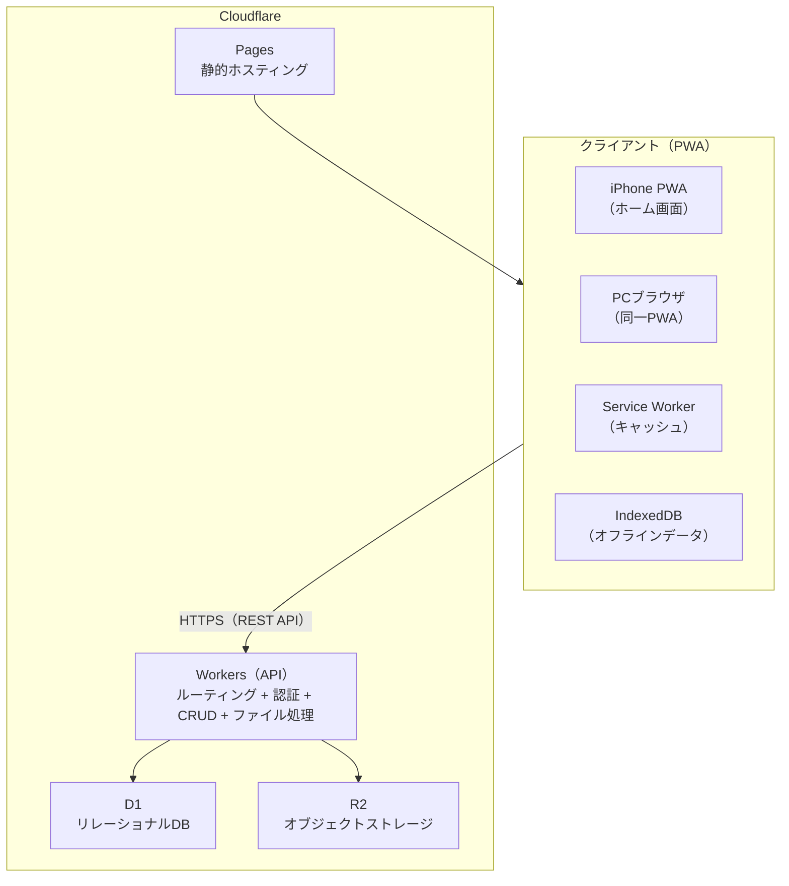
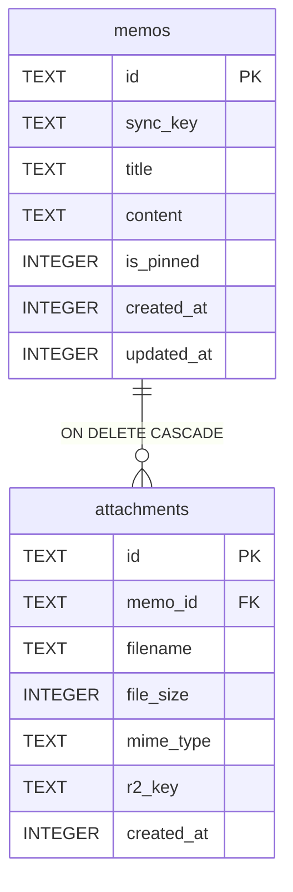
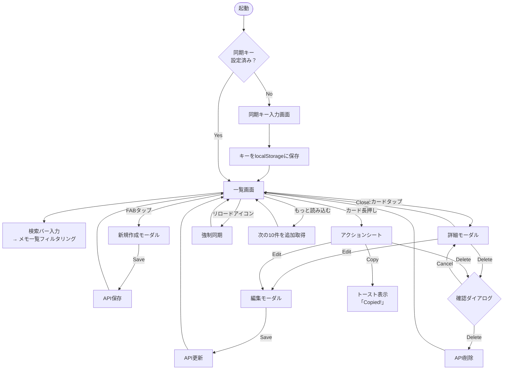
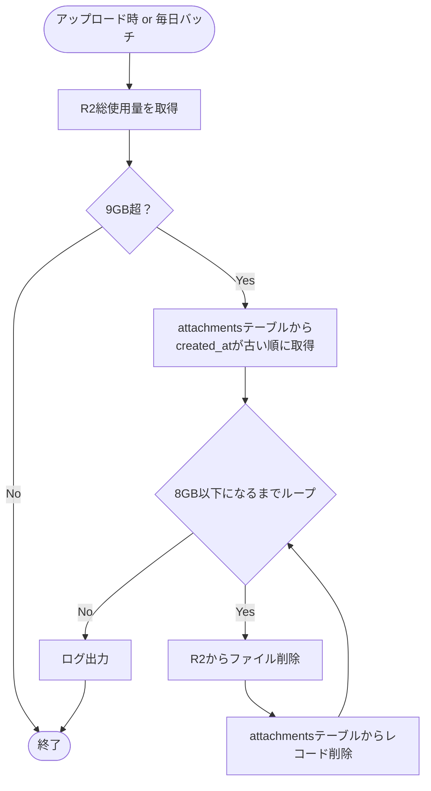
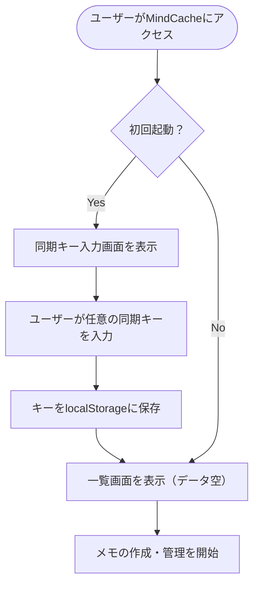
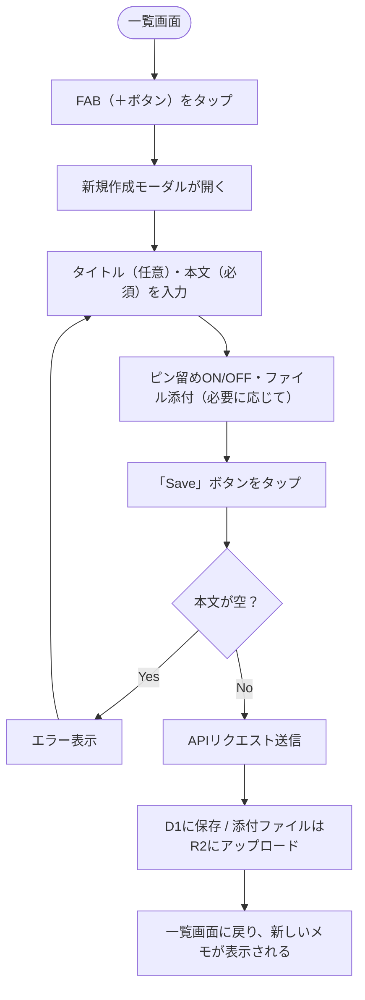
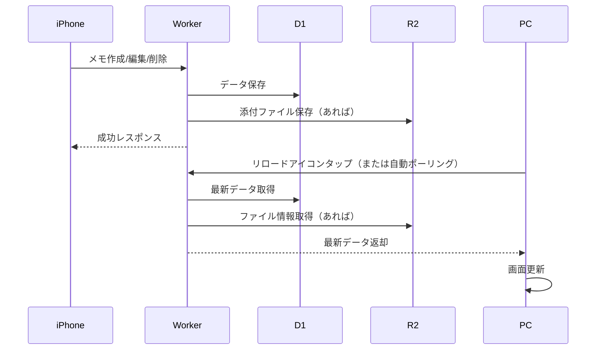
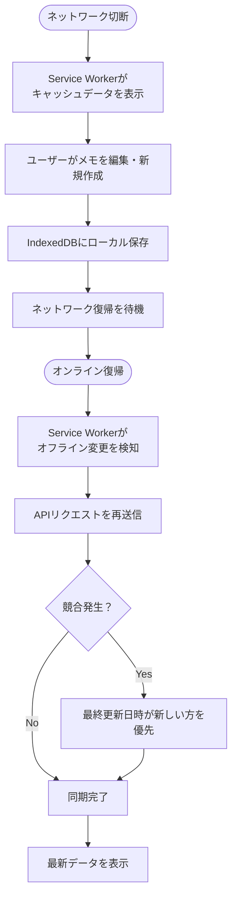
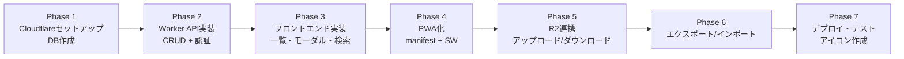

# MindCache 仕様書 v1.0

## 改訂履歴

| 日付 | バージョン | 変更内容 | 作成者 |
|:---|:---|:---|:---|
| 2026-08-31 | 1.0 | 初版作成 | — |


## 1. プロジェクト概要

| 項目 | 内容 |
|:---|:---|
| **プロジェクト名** | MindCache |
| **コンセプト** | 「あれなんだっけ？」をワンタップで解決する自分専用の外部脳 |
| **対象プラットフォーム** | iPhone PWA（ホーム画面追加） + PCブラウザ（同一PWA） |
| **データ同期方式** | 共有キー（パスフレーズ）方式によるクラウド同期 |
| **言語** | 英語UI（ラベル・メッセージは英語統一） |
| **デザイン** | ダークベース + Glassmorphism + グラデーションアクセント（紫→青→シアン） |


## 2. 技術スタック

| レイヤー | 技術 | 補足 |
|:---|:---|:---|
| **フロントエンド** | HTML5 + CSS3 + JavaScript（ES2024） | 素の実装、フレームワーク不使用 |
| **PWA** | manifest.json + Service Worker | オフライン対応・ホーム画面追加 |
| **バックエンドAPI** | Cloudflare Workers | JavaScript（ES modules） |
| **データベース** | Cloudflare D1 | SQLite互換（リレーショナル） |
| **ファイルストレージ** | Cloudflare R2 | S3互換オブジェクトストレージ |
| **ホスティング** | Cloudflare Pages | 静的ファイルホスティング |
| **認証** | 共有キー（パスフレーズ）方式 | ヘッダー認証（`X-Sync-Key`） |
| **アイコンセット** | Lucide（オープンソース） | 線が細くシャープなアイコン |
| **フォント** | システムフォント | `-apple-system, 'Hiragino Sans'` |


## 3. 機能一覧

| No. | 機能名 | 優先度 | 説明 | 実装状況 |
|:---:|:---|:---:|:---|:---:|
| F01 | メモ一覧表示 | 🔥 最優先 | メモをカード形式で一覧表示（最新10件＋ピン留め優先） | ✅ |
| F02 | メモ新規作成 | 🔥 最優先 | タイトル（任意）・本文（必須）を入力して新規メモを作成 | ✅ |
| F03 | メモ詳細表示 | 🔥 最優先 | メモの全文と添付ファイル一覧をモーダルで表示 | ✅ |
| F04 | メモ編集 | 🔥 最優先 | 既存メモのタイトル・本文・ピン留め状態を編集 | ✅ |
| F05 | メモ削除 | 🔥 最優先 | 確認ダイアログ表示後にメモを削除（添付ファイルも自動削除） | ✅（確認は画面内モーダル） |
| F06 | メモ検索 | ⭐ 高 | タイトル＋本文を部分一致でリアルタイム検索 | ✅ |
| F07 | ピン留め | ⭐ 高 | メモをピン留め（一覧上部に固定表示） | ✅ |
| F08 | ページネーション | ⭐ 高 | 最新10件表示＋「もっと読み込む」で追加取得 | ✅ |
| F09 | 本文コピー | ⭐ 高 | メモ詳細画面から本文をワンタップでクリップボードにコピー | ✅ |
| F10 | クラウド同期 | ⭐ 高 | 共有キーによるデータ同期（Cloudflare経由） | ✅ |
| F11 | オフライン対応 | 🔵 中 | Service Workerによるキャッシュ表示＋オフライン編集 | ⚠️ 静的キャッシュのみ。オフライン編集・自動再同期は未実装 |
| F12 | 添付ファイルアップロード | 🔵 中 | メモに画像・ファイルを添付（R2保存） | ✅ |
| F13 | 添付ファイルダウンロード | 🔵 中 | 添付ファイルをタップでダウンロード（Worker経由） | ✅（署名付きURLではなくWorker中継方式） |
| F14 | データエクスポート | 🔵 中 | 全データをJSON形式でダウンロード | ✅ |
| F15 | データインポート | 🔵 中 | JSONファイルからデータを復元（追加・上書き選択可） | ✅ |
| F16 | PWAインストール | 🔵 中 | ホーム画面に追加可能（manifest.json） | ✅（アイコン画像は要配置） |


## 4. 非機能要件

| No. | 項目 | 要件 |
|:---:|:---|:---|
| N01 | **パフォーマンス** | 一覧表示は1秒以内、検索は入力同時にフィルタリング |
| N02 | **可用性** | オフライン時も閲覧・編集可能（オンライン復帰時に自動同期） |
| N03 | **データ永続性** | メモデータはCloudflare D1に永続保存。添付ファイルはR2に保存 |
| N04 | **セキュリティ** | 共有キーによる簡易認証（HTTPS必須） |
| N05 | **スケーラビリティ** | 個人利用を想定。数千メモ・数十GBファイルまで対応 |
| N06 | **メンテナンス性** | 単一コードベースでPWA完結。APIとフロント分離 |


## 5. アーキテクチャ構成図



## 6. ER図



## 7. DB設計（詳細）

### 7.1. memosテーブル

| カラム名 | 型 | NULL | デフォルト | 説明 |
|:---|:---|:---:|:---|:---|
| `id` | TEXT | NO | — | 主キー（UUID / nanoid） |
| `sync_key` | TEXT | NO | — | 共有キー（ユーザー識別子） |
| `title` | TEXT | YES | NULL | メモタイトル（任意） |
| `content` | TEXT | NO | — | メモ本文（必須） |
| `is_pinned` | INTEGER | NO | 0 | ピン留めフラグ（0:OFF / 1:ON） |
| `created_at` | INTEGER | NO | — | 作成日時（Unixタイムスタンプ・ミリ秒） |
| `updated_at` | INTEGER | NO | — | 更新日時（Unixタイムスタンプ・ミリ秒） |

**インデックス**
```sql
CREATE INDEX idx_memos_sync_key ON memos(sync_key);
CREATE INDEX idx_memos_updated ON memos(updated_at DESC);
CREATE INDEX idx_memos_pinned ON memos(sync_key, is_pinned, updated_at DESC);
```

### 7.2. attachmentsテーブル

| カラム名 | 型 | NULL | デフォルト | 説明 |
|:---|:---|:---:|:---|:---|
| `id` | TEXT | NO | — | 主キー（UUID） |
| `memo_id` | TEXT | NO | — | 紐づくメモのID（外部キー） |
| `filename` | TEXT | NO | — | 元のファイル名 |
| `file_size` | INTEGER | NO | — | ファイルサイズ（バイト数） |
| `mime_type` | TEXT | NO | — | MIMEタイプ |
| `r2_key` | TEXT | NO | — | R2バケット内のキー（パス） |
| `created_at` | INTEGER | NO | — | アップロード日時（Unixタイムスタンプ・ミリ秒） |

**インデックス**
```sql
CREATE INDEX idx_attachments_memo_id ON attachments(memo_id);
```

**外部キー制約（ON DELETE CASCADE）**
```sql
-- メモ削除時に関連添付ファイル情報も自動削除
```


## 8. API設計（IF一覧）

### 8.1. 共通仕様

| 項目 | 仕様 |
|:---|:---|
| **ベースURL** | `https://api.mindcache.dev`（仮） |
| **認証** | リクエストヘッダー `X-Sync-Key: <パスフレーズ>` |
| **レスポンス形式** | JSON |
| **エラーレスポンス** | `{ "error": { "code": "ERROR_CODE", "message": "..." } }` |
| **HTTPメソッド** | GET / POST / PUT / DELETE |

### 8.2. エンドポイント一覧

| No. | メソッド | パス | 機能 | リクエストボディ | レスポンス |
|:---:|:---|:---|:---|:---|:---|
| A01 | GET | `/api/memos` | メモ一覧取得（ページネーション） | — | `{ memos: [...], next_cursor: string\|null }` |
| A02 | POST | `/api/memos` | 新規メモ作成 | `{ title?: string, content: string, is_pinned?: boolean }` | `{ memo: {...} }` |
| A03 | GET | `/api/memos/:id` | メモ詳細取得（添付含む） | — | `{ memo: {...}, attachments: [...] }` |
| A04 | PUT | `/api/memos/:id` | メモ更新 | `{ title?: string, content?: string, is_pinned?: boolean }` | `{ memo: {...} }` |
| A05 | DELETE | `/api/memos/:id` | メモ削除（添付も自動削除） | — | `{ success: true }` |
| A06 | POST | `/api/memos/:id/attachments` | 添付ファイルアップロード | `multipart/form-data` | `{ attachment: {...} }` |
| A07 | DELETE | `/api/attachments/:id` | 添付ファイル単体削除 | — | `{ success: true }` |
| A08 | GET | `/api/attachments/:id/url` | ダウンロードURL取得（実体は `/download` への相対リンク） | — | `{ url: string, expires_in: number }` |
| A08b | GET | `/api/attachments/:id/download` | 添付ファイル実体のダウンロード（要`X-Sync-Key`） | — | ファイルバイナリ（`Content-Disposition: attachment`） |
| A09 | GET | `/api/export` | 全データエクスポート | — | `{ version: 1, exported_at: number, memos: [...], attachments: [...] }` |
| A10 | POST | `/api/import` | データインポート | `{ data: JSON, mode: "append"\|"overwrite" }` | `{ success: true, imported_count: number }` |
| A11 | GET | `/api/storage/usage` | R2ストレージ使用量取得 | — | `{ used_bytes: number, limit_bytes: number }` |

> **実装メモ**: R2バインディングAPIには署名付きURL生成機能（`createSignedUrl`）が存在しないため、A08は「Worker経由のダウンロードURL（A08b）」を返す方式で実装している。A08bは`X-Sync-Key`ヘッダーによる認証を要求するため、フロントエンドは`<a href>`や`window.open`ではなく`fetch`+Blob URLでダウンロードを行う。
>
> A11（`/api/storage/usage`）は本バージョンでは未実装。

### 8.3. データモデル（DTO）

**メモオブジェクト**
```json
{
  "id": "abc123",
  "title": "Wi-Fi Password",
  "content": "SSID: myhome-5g\nPassword: Abc12345!",
  "is_pinned": true,
  "created_at": 1725000000000,
  "updated_at": 1725003600000
}
```

**添付ファイルオブジェクト**
```json
{
  "id": "att_001",
  "memo_id": "abc123",
  "filename": "network_diagram.png",
  "file_size": 245760,
  "mime_type": "image/png",
  "r2_key": "uploads/key123/abc123/network_diagram.png",
  "created_at": 1725000000000
}
```


## 9. UI設計（画面イメージと操作フロー）

### 9.1. 一覧画面

```
┌─────────────────────────────────────────────┐
│  🔍   🔄 Synced    │  ✨(FAB:新規追加)    │ ← Glassmorphismヘッダー
├─────────────────────────────────────────────┤
│  [ 🔍 Search... ]                          │ ← 常時表示 検索バー
├─────────────────────────────────────────────┤
│  ─── 📌 Pinned ───                       │ ← ピン留めセクション（あれば表示）
│  ┌─────────────────────────────────────┐  │
│  │  Wi-Fi Password         ⏱ 3h ago   │  │ ← ピン留めカード（左縁グラデーションライン）
│  │  自宅: ********                     │  │
│  └─────────────────────────────────────┘  │
│  ┌─────────────────────────────────────┐  │
│  │  Amazon Delivery        ⏱ 12h ago  │  │
│  │  8/31 13-15時 到着予定              │  │
│  └─────────────────────────────────────┘  │
│  ─── All Memos ───                       │
│  ┌─────────────────────────────────────┐  │
│  │  Dentist 9/3          ⏱ 2d ago     │  │ ← 通常カード
│  │  予約番号: 12345                    │  │
│  └─────────────────────────────────────┘  │
│  ┌─────────────────────────────────────┐  │
│  │  1合 = 180ml           ⏱ 1w ago    │  │
│  │  よく使う変換                       │  │
│  └─────────────────────────────────────┘  │
│  [ もっと読み込む ]                       │ ← 10件超えた場合に表示
└─────────────────────────────────────────────┘
```

**操作フロー（一覧画面）**

| 操作 | 挙動 |
|:---|:---|
| **画面起動** | D1から最新10件＋ピン留めメモを取得して表示 |
| **検索バー入力** | 入力文字列でタイトル＋本文を部分一致フィルタリング（即時反映） |
| **メモカードタップ** | 詳細モーダルを開く |
| **メモカード長押し** | アクションシート表示（編集 / コピー / 削除） |
| **FAB（＋ボタン）タップ** | 新規作成モーダルを開く |
| **リロードアイコンタップ** | 最新データを再取得（同期強制） |
| **「もっと読み込む」タップ** | 次の10件を追加取得（カーソルページネーション） |

### 9.2. メモ詳細モーダル

```
┌─────────────────────────────────────────────┐
│  ✕ Close         ✏️ Edit    🗑️ Delete   │ ← ヘッダー
├─────────────────────────────────────────────┤
│  Wi-Fi Password                             │ ← タイトル（大）
│  Updated 3 hours ago                       │ ← メタ情報
│                                             │
│  自宅Wi-Fi                                  │
│  SSID: myhome-5g                          │
│  パスワード: Abc12345!                     │ ← 本文（全文表示）
│                                             │
│  [ 📋 Copy All ]                           │ ← 本文ワンタップコピー（タップでトースト表示）
│                                             │
│  ─── Attachments ───                       │
│  📎  Wi-Fi設定手順.pdf                     │ ← ファイルリスト（タップでダウンロード）
│  📎  ネットワーク図.png                    │
└─────────────────────────────────────────────┘
```

**操作フロー（詳細モーダル）**

| 操作 | 挙動 |
|:---|:---|
| **Close（✕）タップ** | モーダルを閉じて一覧画面に戻る |
| **Edit（✏️）タップ** | 編集モーダルを開く（新規作成と同一UI、値が事前入力されている） |
| **Delete（🗑️）タップ** | 確認ダイアログ表示 → OKで削除実行 → 一覧に戻る |
| **Copy Allタップ** | 本文全テキストをクリップボードにコピー → トースト表示「Copied!」 |
| **添付ファイルタップ** | 署名付きURLを取得 → 新規タブで開く or ダウンロード開始 |

### 9.3. 新規作成／編集モーダル

```
┌─────────────────────────────────────────────┐
│  ← Back              ✨ Save              │ ← Glassmorphismヘッダー
├─────────────────────────────────────────────┤
│  [  タイトルを入力...  ]  📌              │ ← ピンアイコン（タップでON/OFF）
│                                             │
│  ┌─────────────────────────────────────┐   │
│  │  内容を入力...                      │   │ ← テキストエリア（全文）
│  │                                     │   │
│  │                                     │   │
│  └─────────────────────────────────────┘   │
│                                             │
│  ─── Attachments ───                       │
│  [ ＋ Add File ]                          │ ← タップでファイル選択（複数可）
│  📎 IMG_0001.png  2.4MB                  │ ← 添付リスト（ファイル名＋サイズ）
│  📎 資料.pdf      1.2MB                  │
└─────────────────────────────────────────────┘
```

**操作フロー（作成／編集モーダル）**

| 操作 | 挙動 |
|:---|:---|
| **Back（←）タップ** | 編集内容を破棄して一覧に戻る（確認ダイアログなし） |
| **Save（✨）タップ** | バリデーション（本文必須）→ OKならAPI保存 → 一覧に戻る |
| **ピンアイコンタップ** | ON/OFF切り替え（ON時はアイコン塗りつぶし） |
| **Add Fileタップ** | ファイル選択ダイアログを開く（複数選択可） |
| **添付ファイルの✕タップ** | アップロードリストから削除（まだR2には保存されていない） |


## 10. 画面遷移図



## 11. 利用上限・制約

### 11.1. Cloudflare無料枠（2026年8月時点）

| サービス | 無料枠 | 備考 |
|:---|:---|:---|
| **Workers** | 10万リクエスト/日 | 個人利用ではほぼ超過しない |
| **D1** | 5GB データベース | テキストメモのみなら十分 |
| **R2** | 10GB 保存 / 10GB 転送（月間） | 添付ファイルの容量次第で要注意 |
| **Pages** | 500件/分 ビルド | 静的ホスティングは無制限に近い |

### 11.2. アプリケーション制約

| 項目 | 制約値 | 理由 |
|:---|:---:|:---|
| **1メモあたりの添付ファイル上限** | 10個 | UI/UXの整理性確保 |
| **1ファイルあたり上限** | 無制限（自己責任） | ユーザーの自由を優先 |
| **メモ本文最大文字数** | 100,000文字 | D1のSQLite制限に準拠 |
| **1アカウントあたりのメモ上限** | 制限なし | 個人利用では制限不要 |
| **R2自動削除開始閾値** | 9GB（保存容量） | 無料枠（10GB）を超える前に自動調整 |

### 11.3. R2容量超過時の自動削除ロジック



## 12. セキュリティ対策

| No. | 項目 | 対策 | 実装レベル |
|:---:|:---|:---|:---:|
| S01 | **認証** | 共有キーをリクエストヘッダーで検証（`X-Sync-Key`） | API |
| S02 | **データ分離** | DBクエリに必ず `sync_key` を含め、他のユーザーデータを参照不可に | API |
| S03 | **HTTPS強制** | Cloudflare Pages / WorkersはデフォルトでHTTPS | インフラ |
| S04 | **CORS制限** | 許可するオリジンを限定（Cloudflare Pagesのドメインのみ） | API |
| S05 | **ファイルアクセス制御** | R2ファイルは公開せず、署名付きURL（有効期限1時間）でアクセス | API |
| S06 | **ファイルアップロード制限** | MIMEタイプを検証（画像/PDF/ソースコードなど許可リスト） | API |
| S07 | **XSS対策** | ユーザー入力はエスケープして表示 | フロント |
| S08 | **CSRF対策** | APIはセッションCookie不使用（共有キー方式のため不要） | — |
| S09 | **レート制限** | Workerで同一IPからの過剰リクエストを制限（100req/分） | API |
| S10 | **データ保存時のバリデーション** | 本文必須・文字数制限・ファイルサイズなどのチェック | API |


## 13. 想定利用フロー

### 13.1. 初期設定フロー



### 13.2. メモ作成フロー



### 13.3. 同期フロー（複数デバイス）



### 13.4. オフラインフロー



## 14. 開発フェーズ



| Phase | 内容 | 目安工数 |
|:---|:---|:---:|
| **1** | Cloudflare（Workers + D1 + R2 + Pages）セットアップ + DBテーブル作成 | 0.5日 |
| **2** | Worker API実装（メモCRUD + ページネーション + 共有キー認証） | 1日 |
| **3** | フロントエンド実装（一覧・モーダルCRUD・検索・ピン留め） | 1.5日 |
| **4** | PWA化（manifest + Service Worker + オフラインキャッシュ） | 0.5日 |
| **5** | R2連携（アップロード・ダウンロード・自動削除ロジック） | 1日 |
| **6** | エクスポート/インポート機能実装 | 0.5日 |
| **7** | デプロイ + 動作テスト + アイコン作成 | 0.5日 |

**総合計：約5〜6日**

---